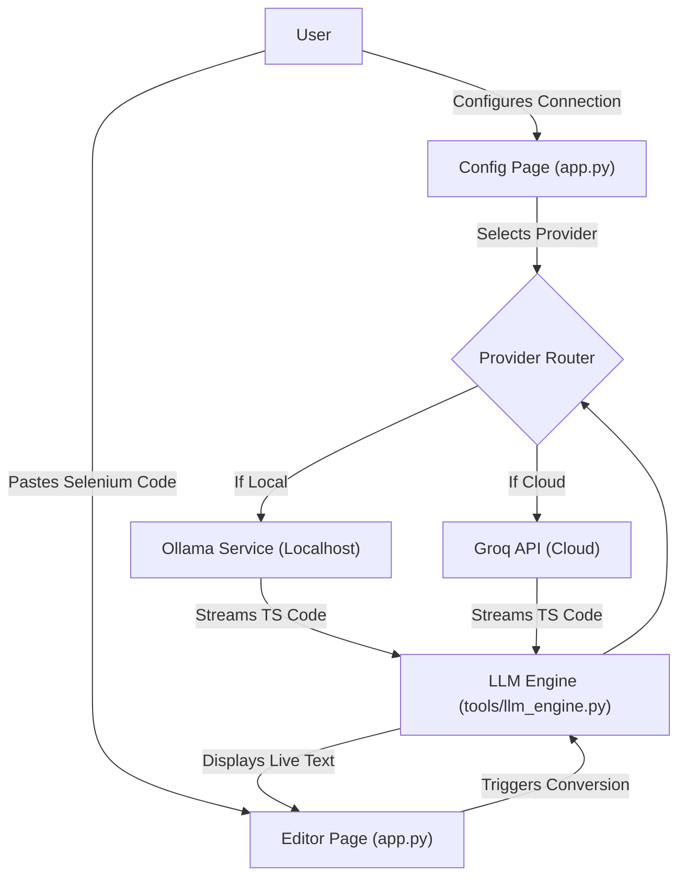

# 🔄 Selenium to Playwright Auto-Converter (Multi-LLM Agent)

Welcome to the **Selenium to Playwright Auto-Converter**! This project is a powerful AI-driven automation agent designed to help QA engineers translate legacy Selenium code (Java or Python) into modern, idiomatic Playwright TypeScript code seamlessly.

This tool now supports a **Dual-LLM Architecture**! You can choose to run conversions 100% locally using **Ollama** (for strict data privacy) OR utilize lighting-fast cloud models using **Groq** APIs!

---

## 🌟 Key Features

1. **Dual-Page Streamlit UI:** Navigate between configuring your LLM API tokens/URLs and the actual Conversion Dashboard.
2. **Strict 17-Rule Engine:** The AI is tightly constrained by a 17-rule framework that explicitly forbids hallucinating syntax and forces the output into strict, explicitly-typed Playwright TypeScript.
3. **ChatGPT-like Streaming:** Code is streamed back to your screen character-by-character the moment the LLM begins "thinking", avoiding massive timeout hangs.
4. **Offline Capability:** If your codebase is proprietary, disable the Groq connection, spin up Ollama with `llama3.2:1b` or `qwen3:4b`, and perform the conversion entirely offline without your data ever leaving your machine.

---

## 🏗️ Project Architecture


*(Note: If the diagram above does not appear on GitHub perfectly, ensure that your browser's dark-mode extension isn't inverting Mermaid elements, as GitHub natively supports this simple node structure.)*

---

## 📂 Folder Structure & Component Breakdown

```text
Selenium_to_playwright_convertor/
│
├── 🏃‍♂️ run_app.bat               # Easy 1-click startup script for Windows.
├── 🖥️ app.py                    # The Streamlit Frontend UI Application with navigation.
├── 📄 requirements.txt          # Python dependencies (Streamlit, requests, dotenv).
├── 🔒 .env                      # Configuration variables (API keys and Base URLs).
│
├── tools/
│   ├── llm_engine.py          # Dual-pipeline script routing prompts to Ollama/Groq streams.
│   └── handshake.py           # Pre-flight checker ensuring Ollama logic is reachable.
│
├── architecture/
│   ├── translation_logic.md   # Documentation on the 17-Rule QA Mapping System.
│   └── ui_components.md       # Notes on UI structural state management.
│
└── 📝 task_plan.md/gemini.md    # Project Constitution tracking memory and protocol goals.
```

### How the Engine Works (`tools/llm_engine.py`):
This acts as the "brain". Instead of letting an AI guess how to write Playwright code, the engine forcefully injects your code underneath 17 heavily structured laws (e.g., instructing it to exclusively map `driver.get` to `await page.goto()`, and to explicitly declare types like `const locator: Locator = ...`). It automatically identifies whether to format its HTTPS payload for an OpenAI-compatible spec (Groq) or a native endpoint (Ollama).

---

## 🚀 Getting Started

To run this application, ensure you have **Python 3.10+** installed.

### Option 1: Quick Windows Start
Navigate to the folder and simply double click:
```text
run_app.bat
```
*(This will auto-install dependencies from `requirements.txt` and launch the browser).*

### Option 2: Manual Terminal Start
```bash
pip install -r requirements.txt
streamlit run app.py
```

### 🎮 How to use the Web App:
1. When your browser opens, click the **"⚙️ Configuration Settings"** button on the left sidebar.
2. Select whether you want to use **Ollama (Local)** or **Groq (Cloud)**.
   - For **Ollama**: Ensure your local Ollama app is running, provide your Base URL (usually `http://localhost:11434`), and hit Connect. Select your desired local model.
   - For **Groq**: Paste your API token safely into the password box and hit Connect. Select any super-model like `llama3-70b-8192` or `openai/gpt-oss-120b`.
3. Switch over to the **"🚀 Selenium to Playwright Auto-Converter"** page.
4. Select your Source Language, paste your legacy code, and click Convert! 
5. You can use the Download `.md` button to save the entire conversational explanation and generated TypeScript file to your hard drive.
