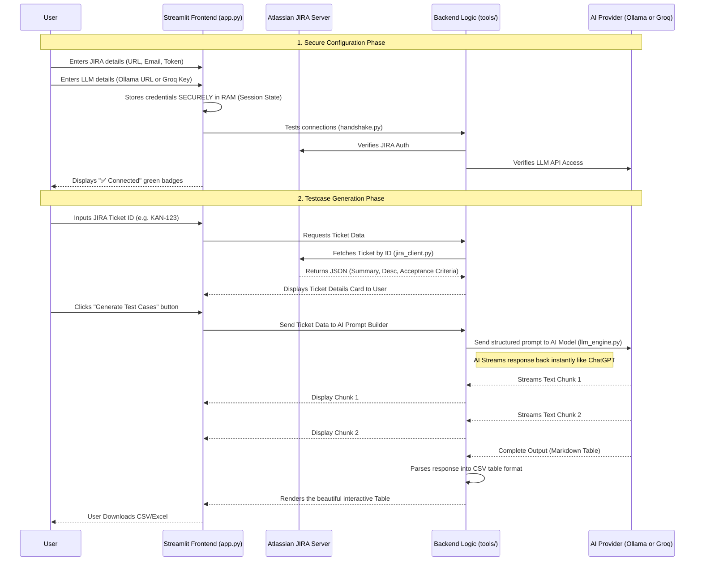

# 🧪 Smart Testcase Creator (JIRA + LLM Integration)

Welcome to the **Smart Testcase Creator**! This application is designed to save QA Engineers countless hours by automatically generating structured, comprehensive manual test cases based on your company's JIRA tickets.

It securely bridges the gap between your Atlassian Jira instance and powerful Artificial Intelligence (LLM) models. 

---

## 🏗️ Project Architecture & Data Flow

This application is built with an absolute focus on **data security and privacy**. All credentials are saved strictly in your computer's RAM memory (Session State) and are completely destroyed when the app stops. 

Here is how the application components interact from start to finish:



---

## 📂 Folder Structure

The project has been organized to be as simple as possible. It is broken into two main parts: The **Frontend UI (`app.py`)** and the **Backend Brain (`tools/`)**.

```text
Smart_Testcase_creator_Jira_Integration_agent/
│
├── app.py                   # The Main Frontend Application
├── run_app.bat              # Simple 1-click script to start the app
├── requirements.txt         # The list of Python libraries needed to run
├── README.md                # You are reading this right now!
│
├── tools/                   # The Backend Brain (All the heavy lifting)
│   ├── __init__.py          # Tells Python that 'tools' is a folder of code
│   ├── handshake.py         # Handshake = "Testing Connections" securely
│   ├── jira_client.py       # Responsible for talking to JIRA
│   └── llm_engine.py        # Responsible for talking to AI (Groq or Ollama)
```

---

## 🧩 How the Code Works (File by File)

Here is a beginner-friendly explanation of exactly what every piece of code in this project does.

### 1. The Frontend UI (`app.py`)
This is the Streamlit interface. It handles everything you see on the screen.
* **Layout:** Creates the dark left sidebar and the light workspace on the right using HTML/CSS styling.
* **Session State:** Highly secure mechanism. It ensures your JIRA Token and Groq API keys are **never** written to a file. It keeps them temporarily in RAM (`st.session_state`).
* **Visual Workflows:** Provides the "Configuration Settings" and "Smart Testcase Generator" navigation. It prevents you from using the AI until you have successfully connected.

### 2. The Connection Tester (`tools/handshake.py`)
Think of this file as the bouncer at the club ensuring you have the right ID.
* **`test_jira_connection()`**: Pings your JIRA URL with your Email and ID just to make sure the login is correct before fetching tickets.
* **`test_groq_connection()`**: Pings the Groq Cloud API with your API Key to make sure it's valid.
* **`test_ollama_connection()`**: Checks if your Local Ollama server is running (usually `http://localhost:11434`) and asks Ollama what AI Models you have installed locally.

### 3. The Ticket Fetcher (`tools/jira_client.py`)
This file is specialized specifically to read Atlassian JIRA formats.
* **`fetch_ticket()`**: Uses your URL + Ticket ID to call the Jira REST API via standard HTTP requests.
* **`_parse_adf()`**: JIRA descriptions often come back in a weird format called "ADF" (Atlassian Document Format). This function translates that computer code into beautiful, plain readable text.
* **`_extract_acceptance_criteria()`**: Intelligently hunts down your Acceptance Criteria. Since JIRA uses bizarre IDs like `customfield_10011`, this dynamically loops through your JIRA's custom field dictionary until it finds the exact field labeled "Acceptance Criteria".

### 4. The AI Generator (`tools/llm_engine.py`)
This is the core intelligence module. 
* **`SYSTEM_PROMPT`**: This is the top-secret prompt that tells the LLM exactly how to act. (e.g., "You are a QA Lead Engineer with 20 years of experience... output only Markdown Tables.")
* **`build_prompt()`**: Combines the raw text from the JIRA ticket with our custom instructions. 
* **`generate_via_groq_stream()` & `generate_via_ollama_stream()`**: These functions securely send the built prompt to the requested AI and return the text *chunk-by-chunk* so the UI can display it in real time, exactly like ChatGPT does.
* **`_parse_llm_response()`**: Since the AI replies in Markdown text, this function cuts out the table formatting and translates it into a structured Python Dictionary so Streamlit can build a beautiful Excel-like CSV table for downloading.

---

## 🛡️ Data Privacy & Security Guarantee

This project handles sensitive enterprise JIRA data, so security is paramount.

- **Zero-Disk Policy:** The app **never** saves JIRA ticket descriptions, acceptance criteria, keys, URLs, emails, or API tokens to your hard drive. 
- **Volatile Memory:** Everything is kept in temporary browser session memory. 
- **Air-Gapped Option:** If your company forbids sending data to Cloud APIs (like Groq), you can switch the UI to **"Ollama (Local)"**. This routes the LLM thinking strictly to your local computer's processor. In this mode, literally *zero* bytes of data leave your actual laptop.

## 🚀 How to Run the App

1. Ensure Ollama is running (if you want to use Local AI).
2. Double-click the `run_app.bat` file in Windows, **OR** open a terminal and type:
   ```bash
   streamlit run app.py
   ```
3. A browser window will open automatically at `http://localhost:8501`.
